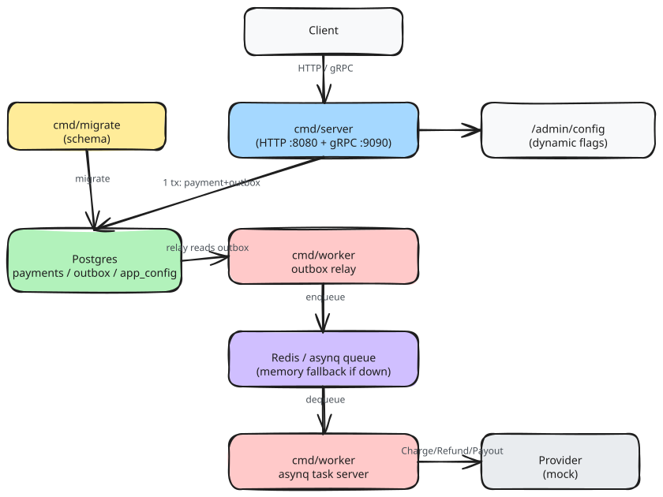

# Fisher-Mapper

A Go payment-gateway template: HTTP (fiber) + gRPC transport in front of a
shared payment domain service, Postgres for state, Redis/asynq for async
task dispatch. Built as a reference implementation of the "outbox +
worker" pattern for payment processing — the request path never calls a
payment provider directly, and every write is a single Postgres
transaction.

## Architecture



Diagram source: [`docs/assets/architecture.excalidraw`](docs/assets/architecture.excalidraw) —
open it at [excalidraw.com](https://excalidraw.com) (or the VS Code /
Obsidian Excalidraw extension) to view or edit it directly; re-export to
`docs/assets/architecture.svg` after editing so the rendered copy above
stays in sync.

Three separate binaries under `cmd/`, sharing everything else via
`internal/`:

- **`cmd/server`** — HTTP-only. Exposes `/healthz`, `/readyz`, payment CRUD,
  `/webhooks/{provider}`, `/admin/config`, plus a gRPC listener for the same
  payment operations. Never calls a provider or touches Redis on the
  request path — creating a payment only writes Postgres (payment row +
  outbox row, one transaction).
- **`cmd/worker`** — the only process that calls a provider's
  Charge/Authorize/Refund/Payout. Runs the outbox relay (Postgres → queue),
  the asynq task server (queue → provider), and the reconciliation job.
  Falls back to an in-memory queue when Redis is unreachable, and wraps
  every provider call in a circuit breaker + bulkhead.
- **`cmd/migrate`** — applies goose migrations. Also has
  `-create-tenant-key` to mint a tenant API key (printed once to stdout —
  that's the only retrieval channel).

## Getting started

```bash
cp .env.example .env        # fill in secrets (admin API key, provider secrets)
make docker-up               # Postgres + Redis
make migrate-up               # apply schema
make run                      # cmd/server on :8080 (HTTP) / :9090 (gRPC)
make run-worker                # cmd/worker, in another shell
```

```bash
curl localhost:8080/healthz
curl localhost:8080/readyz
```

## Development

```bash
go test ./...                          # unit tests
go test ./... -race -count=1           # what pre-push runs
golangci-lint run                      # full-repo lint
lefthook install                       # wire the above into git hooks
```

See [`CLAUDE.md`](CLAUDE.md) for the full architecture/conventions
reference (layout of `internal/`, config tiers, comment-style rules,
in-flight work).
